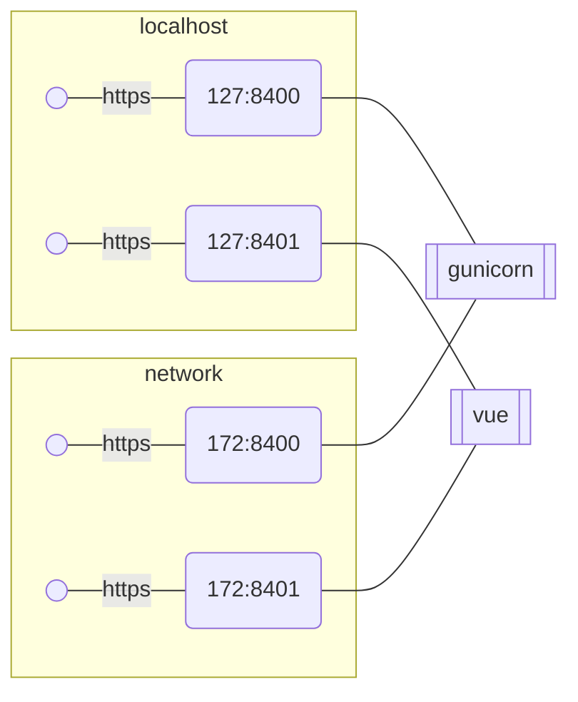

## Initial state.
In initial state both gunicorn and vue expose https interface and manage their own https config.

This creates a drag during local development as https either needs to be disabled or configured.
Disabling https while easy creates a spurious diffs in github.
And configuration of https for local dev is unnecessary work.