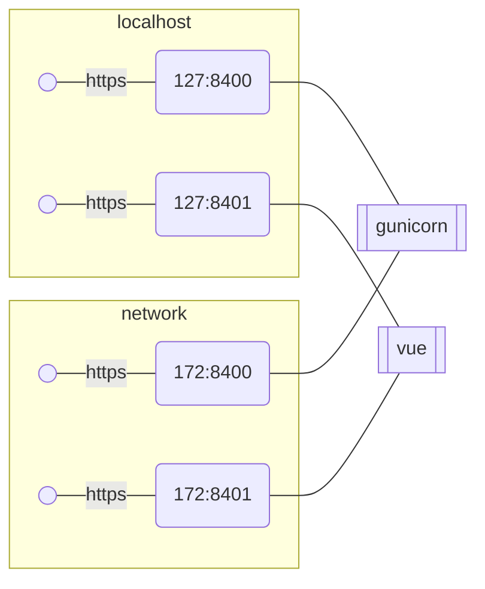
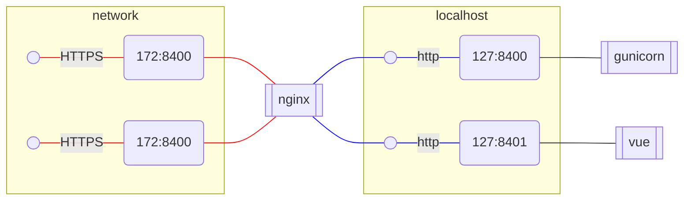
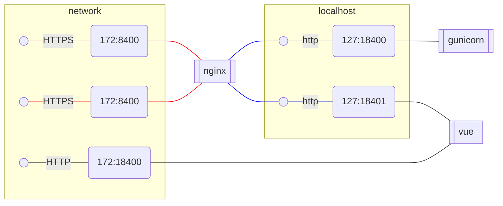

## Initial state.
In initial state both gunicorn and vue expose https on both loopback(127.0.0.1)  and 
network(172.x.x.x) interfaces and manage their own https config.



This creates a drag during local development as https either needs to be disabled or configured.
Disabling https while easy creates a spurious diffs in github.
And configuration of https for local dev is unnecessary work.

## Terminate https
I thought it might be beneficial to terminate https on nginx and make gunicorn and vue always use plain http



## Complication #1 vue doesn't give up network port.

Unfortunately vue doesn't give up network port.
So after some troubles I had to set up a less straightforward scheme where nginx proxies ports
by adding 1 to the port number so https:8400 is forwarded to http:18400



Respective redirect config for nginx
```
proxy_pass http://127.0.0.1:1$server_port;
```
Might confuse people as this is an unusual redirect setup.