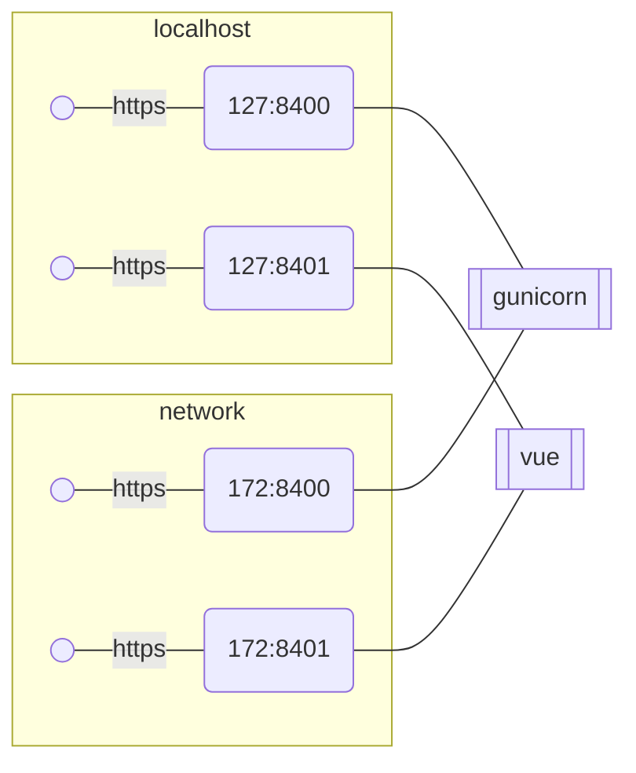
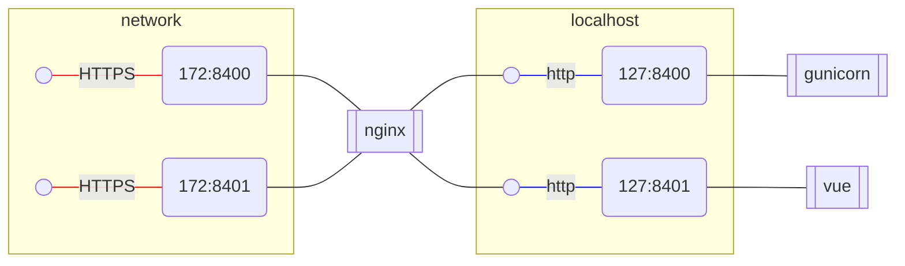
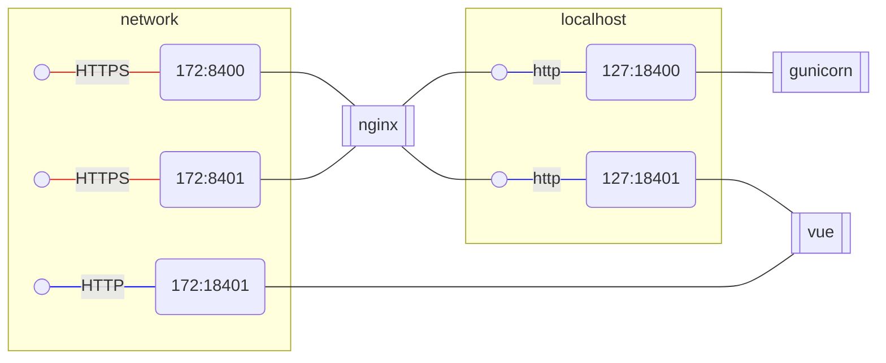
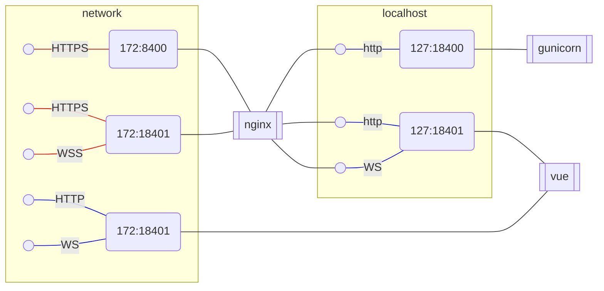

## Initial state.
In the initial state, both Gunicorn and Vue expose HTTPS on both the loopback (127.0.0.1) 
and network (172.x.x.x) interfaces and manage their own HTTPS configuration.



This creates a hassle during local development as HTTPS either needs to be disabled or configured.
Disabling HTTPS, while easy, creates unnecessary differences in GitHub.
Configuring HTTPS for local development is unnecessary work.

## Terminate https
I thought it might be beneficial to terminate HTTPS on Nginx and have Gunicorn and Vue always use plain HTTP.



## Complication #1: Vue doesn't give up the network port.

Unfortunately, Vue doesn't give up the network port. So, after encountering some troubles,
I had to set up a less straightforward scheme where Nginx proxies the ports by adding 1 to the port number. 
So HTTPS:8400 is forwarded to HTTP:18400.



Respective redirect config for nginx
```
proxy_pass http://127.0.0.1:1$server_port;
```
Might confuse people as this is an unusual redirect setup.

## Complication #2: Vue needs to proxy WebSockets too.
Vue relies on WebSockets for communication between the client (web browser) and the server in development mode. 
Therefore, WebSockets need to be proxied as well.



This creates a further complication that when Vue is started in HTTP mode, 
it creates a dynamically unsecured WebSocket backlink. By default, the Vue client in the 
browser will try to communicate with the Vue server on `ws://host:18401`, which is not served. 
This can be explicitly configured in `vue.config.js`:

```javascript
devServer: {
    client: {
        webSocketURL: 'wss://cclaw.legalese.com:8408/ws'
    }
}
```
However, it needs to know the port on the proxy. This can still be done by templating `vue.config`
during the generation of the `vue-0xx` work directory, as the external port is known at the time of 
`vue-0xx` generation. But it further complicates the setup and adds some more "magic".

Basically, what was expected to be a simple proxy setup that simplifies the configuration turned 
out to be a rather complex setup relying on non-standard configurations and runtime template generation.