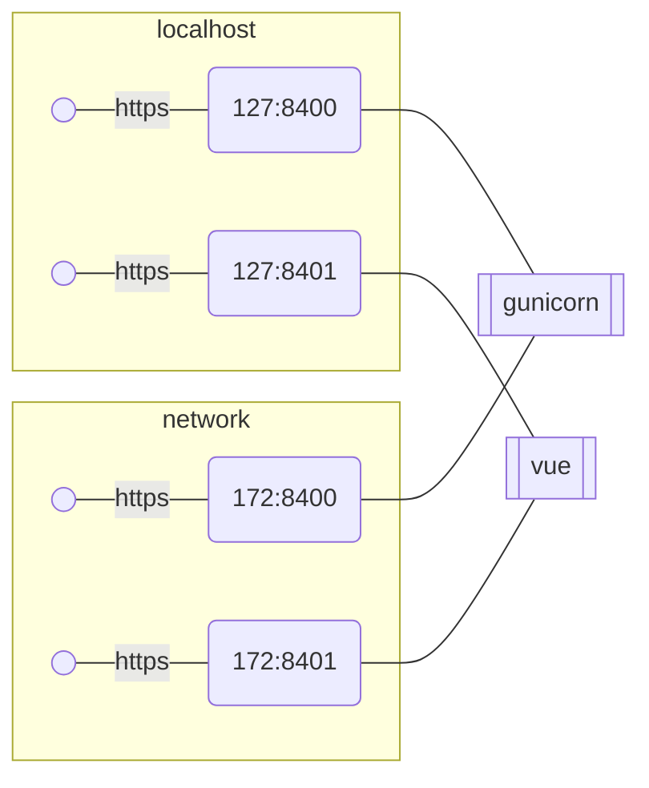
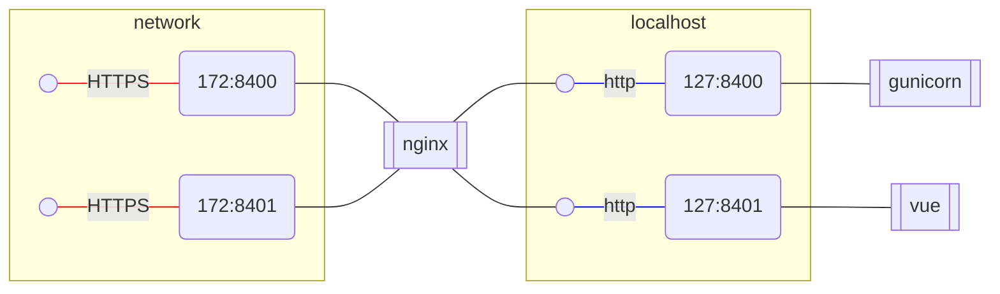
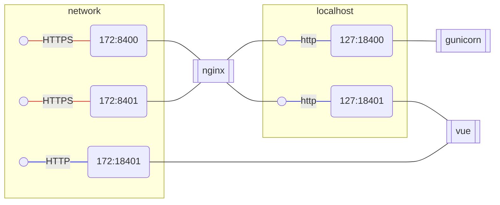
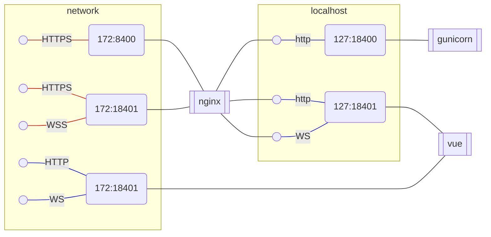

## Initial state.
In initial state both gunicorn and vue expose https on both loopback(127.0.0.1)  and 
network(172.x.x.x) interfaces and manage their own https config.



This creates a drag during local development as https either needs to be disabled or configured.
Disabling https while easy creates a spurious diffs in github.
And configuration of https for local dev is unnecessary work.

## Terminate https
I thought it might be beneficial to terminate https on nginx and make gunicorn and vue always use plain http



## Complication #1: Vue doesn't give up network port.

Unfortunately vue doesn't give up network port.
So after some troubles I had to set up a less straightforward scheme where nginx proxies ports
by adding 1 to the port number so https:8400 is forwarded to http:18400



Respective redirect config for nginx
```
proxy_pass http://127.0.0.1:1$server_port;
```
Might confuse people as this is an unusual redirect setup.

## Complication #2: Vue needs to proxy websocket too.

Vue relies on WebSocket for communication between client(web browser) and server in dev mode.
So it needs to be proxied too.



This creates one further complication that when vue is started in http mode it creates a WebSocket backlink dinamically
and it's unsecured one. So by default vue client in browser will try to talk to vue server on ws://host:18401 which is not served.
This can be explicitely configured in `vue.config.js`

```javascript
devServer: {
    client: {
        webSocketURL: 'wss://cclaw.legalese.com:8408/ws'
    }
}
```
But it needs to know port on the proxy. This can be still done by templating `vue.config` during generation of vue-0xx workdir as
external port is known at the time of vue-0xx generation. But it further complicates setup and adds some more "magic".

Basically what was expected to be a simple proxy setup which simplifies config turned out to be a rather complex setup relying on non-standard
configs and runtime template generation.