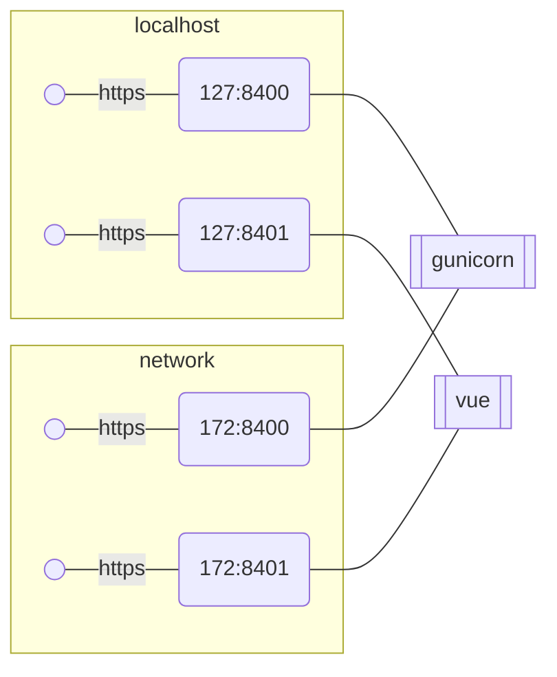
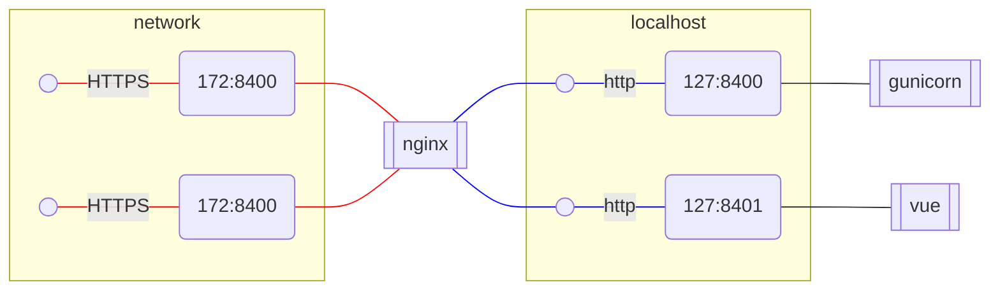

## Initial state.
In initial state both gunicorn and vue expose https on both loopback(127.0.0.1)  and 
network(172.x.x.x) interfaces and manage their own https config.

This creates a drag during local development as https either needs to be disabled or configured.
Disabling https while easy creates a spurious diffs in github.
And configuration of https for local dev is unnecessary work.

## Terminate https
I thought it might be beneficial to terminate https on nginx and make gunicorn and vue always use plain http

